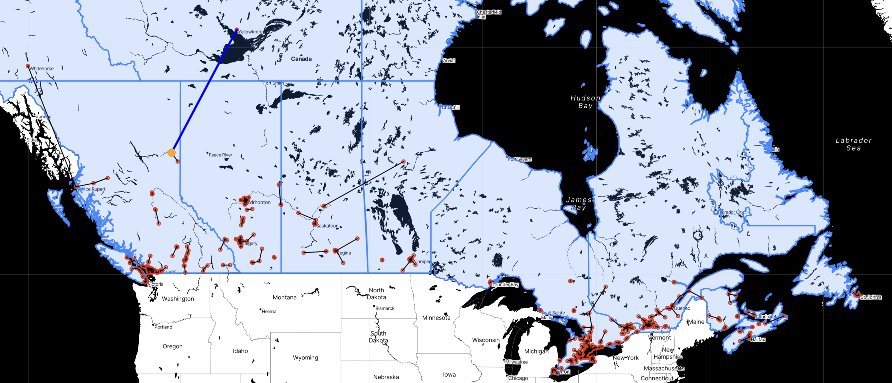

# 🗺️ Starbucks Canada — Store Distribution Analytics


> Mapping every Starbucks store in Canada and computing nearest-neighbor distances, using Python and web scraping.

> Latest dataset file is free to access! If it helps, please star me! ✨
## Features
 
- **Hidden API Scraping**: Reverse-engineers the private API behind [Starbucks' store locator](https://www.starbucks.com/store-locator) by inspecting browser traffic.
- **Nationwide Collection**:
  - Scan a coordinate grid across all of Canada to harvest each store.
  - Scrapes concurrently with `ThreadPoolExecutor` plus retry-and-backoff for stability.
  - Auto-filters US stores from border queries to keep the data clean.
- **Overcome the 50-Store API Limit**:
  - Each query secretly returns at most 50 stores, truncating dense cities.
  - Adaptive grid densification drops finer points wherever the cap is hit, so no store is missed.
- **Faster Nearest-Neighbor Analysis**:
  - Finds each store's closest neighbor using `scikit-learn` BallTree with the Haversine metric.
  - **~3,900× faster** than brute force (18.42 s → 0.0047 s).
- **Multi-Dimensional Visualization**:
  - 🗺️ **Interactive Map**: a zoomable Folium map of all 1,393 stores, with the closest pair and loneliest store highlighted.
  - 📊 **Distance Histogram**: Seaborn distribution of nearest-neighbor distances.
  - 🍁 **Provincial Breakdown**: store counts and density across provinces.
## Introduction
 
This project maps all Starbucks stores across Canada and analyzes the average distance between each store and its nearest neighbor.
 
Given that Starbucks is actively closing stores in Canada (see their [official announcement](https://stories.starbucks.ca/press/2025/message-from-brian-an-important-update/)), any pre-made dataset may fail to reflect the precise status of each store. Thus, I collected the real-time data myself through web scraping on Starbucks' store-locator website. Once collection is done, an HTML map will be generated automatically.
 
## Demonstration
 
+ Click [🌎](/output/Canada_map.html) to see the map!

 
> A screenshot of the visualization.
 
+ The collected dataset is [here](/output/starbucks_Canada_final.csv).
## 📂 File Structure
 
```
Starbucks-in-Canada/
├── main.py            # Orchestrates the full scrape → visualize pipeline
├── scraper.py         # Concurrent API scraping (ThreadPoolExecutor, retry/backoff)
├── city.py            # Generates coordinate grids around city centers
├── densify.py         # Adaptive grid densification to beat the 50-store cap
├── distance.py        # Nearest-neighbor search: BallTree + Haversine (+ O(n²) baseline)
├── visualize.py       # Builds the Folium map and Seaborn histogram
├── record_time.py     # @timer decorator for benchmarking
├── config.py          # API headers, URLs, file paths, city coordinates
├── data/
│   ├── postal-codes-canada.csv   # Coordinate input
│   └── canada.geojson            # Boundary overlay for the map
├── output/
│   ├── starbucks_Canada_final.csv   # Final dataset (1,393 stores)
│   ├── Canada_map.html              # Interactive map
│   └── CAclosest_dist_hist.png      # Distance histogram
├── pics/              # Images used in this README
├── requirement.txt    # Python dependencies
└── README.md
```
 
## 🛠️ Setup & Installation
 
Requires **Python 3.9+**.
 
```sh
# 1. Clone the repository
git clone https://github.com/Pitachin/Starbucks-in-Canada.git
cd Starbucks-in-Canada
 
# 2. Create and activate a virtual environment
python3 -m venv .venv
source .venv/bin/activate          # Windows: .venv\Scripts\activate
 
# 3. Install dependencies
pip install -r requirement.txt
```
 
The interactive map uses tiles served via [Stadia Maps](https://stadiamaps.com/), which require a free API key. Create a local `secret.py` (already gitignored) and add yours:
 
```python
# secret.py
STADIA_KEY = "your-key-here"
```
 
## 🚀 Usage
 
Run the entire pipeline (scrape → analyze → visualize) with one command:
 
```sh
python3 main.py
```
 
Or run each stage independently:
 
```sh
python3 scraper.py      # Collect store data → output/starbucks_Canada_final.csv
python3 distance.py     # Print nearest-neighbor stats and the speed benchmark
python3 visualize.py    # Build the map and histogram
```
 
After running, open `output/Canada_map.html` in your browser to explore the interactive map.
 
## ⚠️ Notes
 
- **Run from the terminal**, inside the activated virtual environment. VS Code's ▶️ "Run" button uses the system Python and will not find the installed packages.
- **Be gentle with the scraper.** It includes deliberate delays between requests to avoid triggering Starbucks' anti-scraping defenses. Removing them risks getting your IP temporarily blocked (`403` errors).
- **The store count is a snapshot.** Data was collected in 2026; the total will drift over time as Starbucks opens and closes locations. The dataset reflects the day it was scraped, not a permanent figure.
- **The Stadia Maps API key is required** for map rendering. Without a valid key in `secret.py`, the tiles will not load.
## 📄 License
 
This project is licensed under the MIT License — see the [LICENSE](LICENSE) file for details.
 
---
 
*Built as a portfolio project in data engineering and geospatial analysis. If you found it useful, a ⭐ is always appreciated!*
 