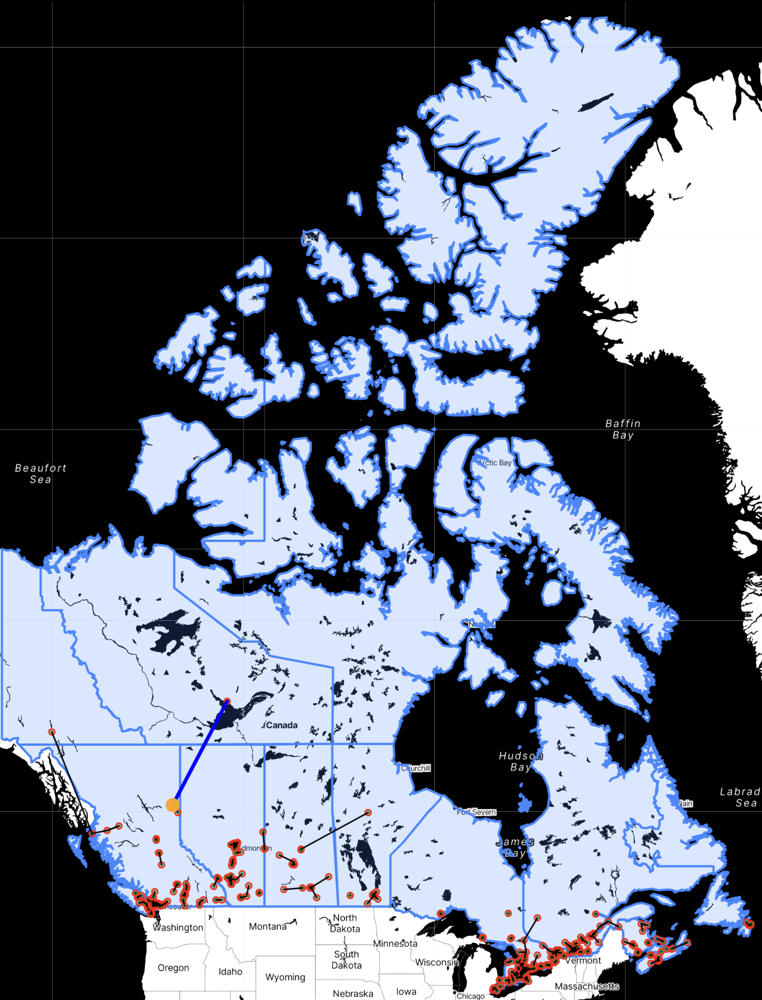

# 🗺️ Starbucks Canada — Store Distribution Analytics


> Based on Web Scraping, Python, mapping every Starbucks stores in Canada and their corresponding minimal distance.

> Latest dataset file is free to access! If it helps, please star me!✨

## Features

 
- **Hidden API Scraping**: Reverse-engineers the private API behind [Starbucks' store locator](https://www.starbucks.com/store-locator) by inspecting browser traffic.
- **Nationwide Collection**:
  - Scan a coordinate grid across all of Canada to harvest each store.
  - Scrapes concurrently with `ThreadPoolExecutor` plus retry-and-backoff for stability.
  - Auto-filters US stores from border queries to keep the data clean.
- **Overcome the 50-Store API Limit**:
  - Each query secretly returns at most 50 stores, truncating dense cities.
  - Adaptive grid densification drops finer points wherever the cap is hit, so no store is missed.
- **Faster Nearest-Neighbor Analysis**:
  - Finds each store's closest neighbor using `scikit-learn` BallTree with the Haversine metric.
  - **~3,900× faster** than brute force (18.42 s → 0.0047 s).
- **Multi-Dimensional Visualization**:
  - 🗺️ **Interactive Map**: a zoomable Folium map of all 1,393 stores, with the closest pair and loneliest store highlighted.
  - 📊 **Distance Histogram**: Seaborn distribution of nearest-neighbor distances.
  - 🍁 **Provincial Breakdown**: store counts and density across provinces. 

## Introduction

This project maps all Starbucks stores across Canada and analyzes the average distance between each store and its nearest neighbor.

Given that Starbucks is actively closing stores in Canada (see their [official announcement](https://stories.starbucks.ca/press/2025/message-from-brian-an-important-update/)), any pre-made dataset may fail to reflects the precise status of each store. Thus, I collected the real-time data myself through web scraping on Starbucks' store-locator website. Once collection is done, an HTML map will be generated automatically.
## Demonstration

+ Click [🌎](/output/Canada_map.html) to see the map!



> National view — every store (red dots), the closest pair (orange), and the most isolated store (blue line).


> Zoomed-in view — store clustering along Canada's southern corridor.

+ Collected dataset is [here](/output/starbucks_Canada_final.csv)


## 📂 File Structure
```
Starbucks in Canada/
├── main.py                  # Orchestrator: runs scraper.py, then visualize.py
├── scraper.py               # Hidden-API scraper (ThreadPoolExecutor + retry/backoff)
├── city.py                  # Builds dense coordinate grids around major cities
├── densify.py               # Adaptive densification around truncated (50-cap) points
├── distance.py              # Nearest-neighbor distances (BallTree + Haversine)
├── visualize.py             # Builds the Folium map + Seaborn histogram
├── config.py                # API headers/URL, file paths, city coordinates
├── secret.py                # Stadia Maps API key (git-ignored)
├── record_time.py           # @timer decorator for benchmarking
├── requirement.txt          # Python dependencies
├── data/
│   ├── postal-codes-canada.csv   # Seed coordinates (postal-code centroids)
│   └── canada.geojson            # Canada boundary overlay
├── output/
│   ├── starbucks_Canada_final.csv  # Final dataset (1,393 stores)
│   ├── Canada_map.html             # Interactive Folium map
│   └── CAclosest_dist_hist.png     # Nearest-neighbor distance histogram
├── pics/                    # README images
└── info.md                  # Dev notes: API response samples & experiment logs
```

## 🛠️ 环境配置与安装

Requires **Python 3.9+**.

```bash
# 1. Clone the repository
git clone <your-repo-url>
cd "Starbucks in Canada"

# 2. Create and activate a virtual environment
python3 -m venv .venv
source .venv/bin/activate        # Windows: .venv\Scripts\activate

# 3. Install dependencies
pip install -r requirement.txt
```

The interactive map uses [Stadia Maps](https://stadiamaps.com/) tiles, which require a free API key.
Create a `secret.py` (or set `STADIA_KEY` in `config.py`) with your own key:

```python
# secret.py
STADIA_KEY = "your-stadia-maps-api-key"
```

## 🚀 使用指南

Run the full pipeline (scrape → visualize) with a single command:

```bash
python main.py
```

Or run each stage individually:

```bash
python scraper.py      # Collect stores  → output/starbucks_Canada_final.csv
python densify.py      # Optional: fill gaps in dense provinces (ON / AB / BC)
python distance.py     # Print nearest-neighbor stats (avg / closest / farthest)
python visualize.py    # Build the map + histogram into output/
```

**Outputs** (written to `output/`):
- `starbucks_Canada_final.csv` — the full store dataset
- `Canada_map.html` — interactive Folium map
- `CAclosest_dist_hist.png` — nearest-neighbor distance histogram

## ⚠️ 注意事项

- **For educational / personal use only.** Respect Starbucks' Terms of Service and `robots.txt`. The scraper includes randomized delays and exponential backoff — please don't hammer the endpoint.
- **Unofficial API.** The store-locator endpoint is private and undocumented; it can change or break at any time.
- **50-store cap.** Each query returns at most 50 stores. Use `densify.py` to refine dense urban areas.
- **Stadia Maps key required** for map tiles (free tier is sufficient). Keep your key in `secret.py` — never commit it.
- **Point-in-time snapshot.** Data reflects the moment of scraping; Starbucks is actively closing Canadian stores, so counts will drift over time.

## 📄 License

For educational and personal use. If you intend to open-source this project, add a `LICENSE` file (e.g., [MIT](https://choosealicense.com/licenses/mit/)).
